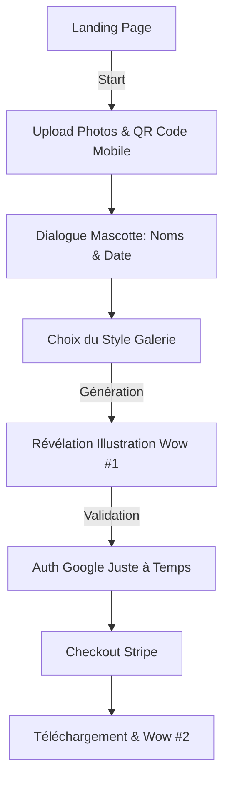
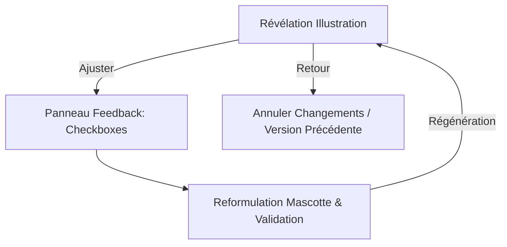
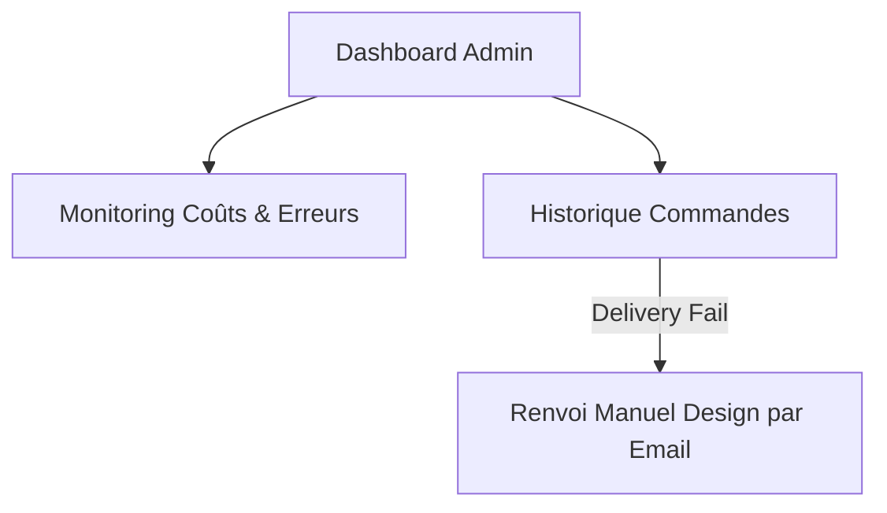

# UX Design Specification poster-generator

**Author:** Aldo
**Date:** 2026-02-14

---

## Executive Summary

### Project Vision
Poster-generator transforme l'expérience du design de mariage en un moment d'excitation pure. En convertissant les photos réelles du couple en **illustrations graphiques stylisées** (style transfer), l'outil garantit un résultat artistique premium constant. Cette approche élimine les déceptions liées aux artefacts de l'IA sur les visages réels et positionne le produit comme un service d'illustration virtuel abordable et magique.

### Target Users
*   **Explorateurs Enthousiastes :** Couples cherchant une annonce unique et artistique pour leur Save the Date.
*   **Utilisateurs en quête d'esthétique :** Personnes valorisant un rendu "fait main" ou "œuvre d'art" plutôt qu'un simple montage photo.
*   **L'Organisatrice & Le Duo :** Parcours optimisé pour la découverte solo (mobile) et la validation collaborative (desktop).

### Key Design Challenges
*   **Reconnaissance Stylisée :** Maintenir les traits caractéristiques du couple à travers l'illustration.
*   **Gestion des Attentes :** Clarifier immédiatement que le résultat sera une illustration artistique et non une photo retouchée.
*   **Variété Artistique :** Proposer des styles d'illustration suffisamment variés (aquarelle, line-art, etc.) dans les 5 templates MVP.

### Design Opportunities
*   **Effet "Révélation Artistique" :** Animer la génération pour montrer le processus créatif de l'IA (le trait de pinceau, l'esquisse).
*   **Interface Caméléon :** Harmoniser les couleurs de l'App avec le style d'illustration généré.

## Core User Experience

### Defining Experience
L'expérience cœur est centrée sur la **"Configuration Magique"** : un flux linéaire et rapide où l'utilisateur assemble ses ingrédients (photos, texte, style) pour préparer la première alchimie de l'IA. Cette étape doit être perçue comme un jeu de création plutôt que comme un formulaire administratif.

### Platform Strategy
*   **Hybridation QR Code (Mode Lean) :** Pour les utilisateurs sur Desktop, un QR Code permet d'uploader les photos depuis le mobile (accès direct à la pellicule). Un rafraîchissement manuel ou un bouton de confirmation sur l'ordinateur permet de récupérer les photos stockées en BDD sans la complexité des WebSockets.
*   **Persistance par Session :** Le stockage en base de données lié à l'identifiant de session assure que le brouillon est récupéré quel que soit l'appareil.

### Effortless Interactions
*   **Zero-Friction Upload :** Drag & drop intuitif et pré-visualisation instantanée.
*   **Ajustement Textuel Automatique :** L'IA adapte la taille et la position du texte selon les visages détectés dans l'illustration pour garantir la lisibilité.

### Critical Success Moments
*   **Le Grand Dévoilement (Wow #1) :** La première fois que le couple voit ses photos transformées en œuvre d'art stylisée.
*   **Le Moment de Possession (Wow #2) :** La réception du fichier 4K ultra-net, sans watermark, marquant la concrétisation du projet.

### Experience Principles
1.  **Vitesse Créative :** Ne jamais laisser l'utilisateur stagner ; chaque étape doit mener à une récompense visuelle.
2.  **Continuité Trans-Appareils :** Le passage du mobile au desktop doit être un pont, facilité par le QR Code.
3.  **Qualité Prédictive :** L'IA doit faire le gros du travail de mise en page pour garantir un résultat "designer" sans effort.

## Desired Emotional Response

### Primary Emotional Goals
Transformer une tâche logistique en une **"Victoire Émotionnelle"**. L'utilisateur doit se sentir **Inspiré** et **Soulagé** par la simplicité radicale du processus. Le sentiment final est la **Fierté** et le désir immédiat de partage.

### Emotional Journey Mapping
*   **Découverte :** *Espoir & Curiosité* – "La solution que j'attendais."
*   **Upload & Configuration :** *Confiance & Anticipation* – Minimalisme rassurant.
*   **Attente (Génération) :** *Excitation Ludique* – Le suspense du processus créatif.
*   **Révélation :** *Émerveillement & Joie* – Le moment magique de la transformation.
*   **Achat & Partage :** *Accomplissement & Fierté* – Le couple mis en valeur.

### Micro-Emotions
*   **Sérénité :** Par une interface épurée sans surcharge visuelle.
*   **Appartenance :** Partage complice via QR Code avec le partenaire.
*   **Magie :** Ressentie lors de la métamorphose artistique des visages.

### Design Implications
*   **Interface "Zéro-Bruit" :** Espaces blancs, typographies élégantes, ton de voix chaleureux et personnel ("votre histoire", "votre moment").
*   **QR Code de Partage :** Lien d'aperçu rapide pour impliquer le partenaire.
*   **Feedback Bienveillant :** Guidage doux et humain, évitant le jargon technique.

### Emotional Design Principles
1.  **Le Minimalisme comme Calmant :** Réduire le stress des préparatifs par la clarté.
2.  **La Magie au Centre :** Convergence de l'UX vers le moment de la révélation.
3.  **Partage Complice :** Faciliter la co-création pour renforcer le lien du couple.

## UX Pattern Analysis & Inspiration

### Inspiring Products Analysis
*   **Airbnb & Apple Music :** Maîtrise de la hiérarchie visuelle et des espaces blancs. L'interface s'efface devant le contenu pour une clarté maximale.
*   **Notion :** Utilisation d'un style monochrome (Noir & Blanc) extrêmement efficace pour la concentration.
*   **Instagram :** Fluidité exemplaire dans la manipulation de médias (upload/preview).

### Transferable UX Patterns
*   **Pattern de "Focus Mode" :** Masquer tout ce qui n'est pas nécessaire à l'étape en cours pour maximiser la concentration (style Notion).
*   **Composants shadcn/ui :** Utilisation de composants modernes, sobres et polis pour une sensation "tech-native" et premium.
*   **Navigation Linéaire :** Un tunnel de conversion direct sans menus latéraux.

### Anti-Patterns to Avoid
*   **Surcharge visuelle :** Éviter les fioritures inutiles qui ralentissent le parcours émotionnel.
*   **Complexité de configuration :** Ne pas demander trop de micro-décisions techniques à l'utilisateur.

### Design Inspiration Strategy
*   **À Adopter :** Le style monochrome inspiré de Notion avec une couleur d'identité de marque fixe pour l'accentuation.
*   **À Adapter :** La simplicité des bibliothèques comme **shadcn/ui** pour construire une interface robuste et élégante rapidement.
*   **À Éviter :** Le Dynamic Theming, au profit d'une cohérence visuelle forte et d'une identité de marque stable.

## Design System Foundation

### 1.1 Design System Choice
**shadcn/ui** (utilisant Radix UI et Tailwind CSS).

### Rationale for Selection
*   **Efficacité Solo-Dev :** Permet de construire une interface "High Polish" très rapidement sans sacrifier le contrôle.
*   **Esthétique Minimaliste :** Aligné par défaut avec les références (Notion, Airbnb) tout en étant facilement personnalisable pour le style monochrome recherché.
*   **Technique :** Intégration native avec Next.js et Tailwind CSS, offrant une performance optimale et une accessibilité intégrée.

### Implementation Approach
Les composants seront copiés et personnalisés directement dans le projet pour éviter toute dépendance rigide. L'accent sera mis sur l'utilisation de **Radix UI** pour garantir une expérience inclusive (accessibilité).

### Customization Strategy
*   **Design Tokens :** Définir une palette "Noir & Blanc" stricte avec une seule couleur d'identité de marque pour les interactions primaires.
*   **Minimalisme Radical :** Simplification des composants shadcn pour supprimer toute ombre ou bordure non essentielle, renforçant l'effet "galerie d'art".

## Visual Design Foundation

### Brand Identity: **Siana Memento**
Un nom qui évoque l'élégance de la création artistique (Siana) et la préservation éternelle des souvenirs (Memento).

### Color System
*   **Identité de Marque (Accent) :** **Vert Sauge Botanique** (#2D4A3E). Une couleur profonde, sereine et prestigieuse, parfaitement alignée avec l'univers du mariage haut de gamme.
*   **Palette Neutre :**
    *   **Fond :** Blanc "Glace" (#FAFAFA) pour un aspect galerie d'art épuré.
    *   **Texte :** Noir Profond (#09090B) pour une lisibilité maximale et un contraste fort.
*   **Sémantique :** Le Vert Sauge est utilisé pour les boutons d'action primaires et les indicateurs de succès. Le reste de l'interface reste monochrome.

### Typography System
*   **Titres :** **Clash Display** (Variable). Une police géométrique et impactante pour affirmer l'identité de marque.
*   **Interface & Corps :** **Satoshi** (Variable). Une police sans-serif moderne, sobre et ultra-lisible.
*   **Philosophie :** 100% Sans-Serif pour un look "Tech-Premium".

### Spacing & Layout Foundation
*   **Mise en page :** **Contenu Centralisé** ("Focus Card") pour un tunnel de conversion sans distraction.
*   **Rythme :** Système de grille de **8px**.
*   **Aération :** Espaces blancs généreux pour réduire le stress et renforcer l'aspect luxueux.

### Accessibility Considerations
*   **Contraste :** Le Vert Sauge Botanique offre un excellent ratio de contraste sur fond blanc pour les éléments interactifs.
*   **Lisibilité :** Taille de police minimale de 16px pour le corps de texte.

## Design Direction Decision

### Design Directions Explored
Nous avons exploré 6 directions visuelles allant du minimalisme absolu au mode conversationnel, en passant par des structures de type galerie, dashboard et split-screen. L'objectif était de trouver l'équilibre entre l'émotion du mariage et l'innovation de l'IA.

### Chosen Direction: Parcours Hybride Émotionnel
Nous avons opté pour une structure hybride qui adapte l'interface à l'état émotionnel de l'utilisateur à chaque étape :
1.  **Accueil & Upload (Inspiration Direction 1) :** Minimalisme absolu avec focus sur les photos du couple.
2.  **Saisie des Informations (Inspiration Direction 4) :** Mode conversationnel assisté par la mascotte IA (✨) pour humaniser la collecte des noms et de la date.
3.  **Sélection du Style (Inspiration Direction 2) :** Grille de galerie élégante pour valoriser les 5 univers artistiques.
4.  **Révélation & Achat (Inspiration Direction 3) :** Focus éditorial "Luxe" pour magnifier l'illustration finale et faciliter l'acte d'achat.

### Design Rationale
Cette approche permet de :
*   Réduire la friction initiale par la simplicité.
*   Créer un lien affectif via la mascotte.
*   Maximiser la valeur perçue lors du rendu final (Wow Effect).
*   Garantir une clarté absolue dans le tunnel de conversion.

### Implementation Approach
Utilisation intensive des composants **shadcn/ui** customisés. Les transitions entre les étapes seront soignées pour maintenir la fluidité (animations CSS légères, transitions de page fluides). Le layout restera centralisé ("Focus Card") sur toutes les étapes pour maintenir l'identité visuelle de **Siana Memento**.

## 2. Core User Experience

### 2.1 Interaction Signature
L'interaction signature est la **"Co-Création Assistée"**. Le produit agit comme un "Maître Illustrateur" IA qui dialogue avec le couple.

### 2.2 User Mental Model
Le modèle mental passe de "Outil de montage" à **"Commande d'Artiste"**. L'utilisateur se sent comme un client chez un professionnel, validant des ébauches et donnant des directions pour affiner l'œuvre.

### 2.3 Success Criteria
*   **Compréhension Validée :** L'utilisateur doit se sentir écouté lors de la reformulation du feedback par l'IA.
*   **Efficacité Itérative :** Résultat parfait atteint en moyenne après un seul cycle de feedback.
*   **Délégation Créative :** L'IA prend en charge la complexité technique, l'utilisateur garde le plaisir du choix.

### 2.4 Novel UX Patterns
*   **Mascotte Facilitatrice :** Un personnage stylisé (ex: une plume dorée) qui humanise le processus, commente les choix et guide l'utilisateur avec bienveillance.
*   **Validation du Brief de Régénération :** Une étape intermédiaire où l'IA reformule le feedback utilisateur ("D'accord, je vais agrandir les noms...") avant de relancer la génération.

### 2.5 Experience Mechanics
1.  **Initiation :** L'upload et le choix du style déclenchent l'accueil enthousiaste de la mascotte.
2.  **Interaction :** Si besoin d'ajustements, l'utilisateur accède à un panneau de feedback simple (checkboxes + texte).
3.  **Boucle de Feedback :** La mascotte analyse, reformule de manière chaleureuse et attend la validation du "nouveau brief".
4.  **Achèvement :** L'illustration finale est révélée avec une célébration visuelle discrète (confettis numériques).

## User Journey Flows

### 1. Le Flux Magique (Sophie & Thomas)
Parcours idéal de l'utilisateur cherchant efficacité et émotion.

### 2. La Boucle de Raffinement (Claire & Marc)
Parcours itératif pour les utilisateurs exigeants cherchant le contrôle.

### 3. Parcours Support (Aldo Admin)
Parcours de gestion simplifiée pour le créateur.

### Journey Patterns
*   **Focus Card System :** Toutes les interactions se passent au centre de l'écran dans un conteneur dédié.
*   **Progression Narrative :** La mascotte ✨ assure la transition entre chaque étape technique.
*   **Auth Contextuelle :** L'authentification n'est demandée que lorsque la valeur a été prouvée (après la vue de l'illustration).

### Flow Optimization Principles
1.  **Réduction de Friction :** Pas de formulaire complexe, priorité au dialogue et au choix visuel.
2.  **Sécurité Émotionnelle :** Toujours permettre de revenir en arrière ou d'annuler une modification IA.
3.  **Vitesse Perçue :** Utilisation de micro-interactions narratives pendant les temps de calcul IA.

## Component Strategy

### Design System Components (shadcn/ui)
Nous utilisons les composants de base pour garantir rapidité et accessibilité :
*   **Boutons, Inputs, Cartes :** Pour toutes les interactions standard.
*   **Progress Bar & Toasts :** Pour le feedback système et le suivi de génération.
*   **Dialog & Sheet :** Pour les modales de feedback et les paramètres secondaires.

### Custom Components ("Signature Siana")
Composants uniques développés pour l'expérience cœur de Siana Memento :
1.  **✨ IA Mascot Messenger :** Dialogue narratif avec micro-animations ✨ pour guider l'utilisateur.
2.  **📸 Cross-Device Upload Bridge :** Affichage du QR Code avec indicateur d'état dynamique pour l'upload mobile.
3.  **🎨 Style Universe Selector :** Galerie enrichie avec effets de zoom "Luxe" pour le choix artistique.
4.  **📝 Feedback Loop Panel :** Interface combinée (checkboxes + texte) pour piloter l'IA.
5.  **🪄 The Reveal Canvas :** Conteneur d'illustration avec chargement progressif (progressive loading) et célébration de réussite.

### Component Implementation Strategy
Tous les composants custom seront isolés dans `/components/siana/` et construits en étendant les primitives de shadcn/ui (Radix UI + Tailwind). Cela garantit une maintenance simplifiée et une cohérence visuelle totale.

### Implementation Roadmap
*   **Phase 1 (Core) :** Upload Bridge, Style Selector, Mascot Messenger.
*   **Phase 2 (Feedback) :** Loop Panel, Reveal Canvas (Version de base).
*   **Phase 3 (Polissage) :** Animations de célébration, chargement progressif avancé.

## UX Consistency Patterns

### Button Hierarchy
*   **Action Primaire :** Fond Vert Sauge (#2D4A3E), texte blanc. Utilisé pour la progression (Suivant, Acheter). Sur mobile, ce bouton est "Sticky" en bas de l'écran pour l'accessibilité au pouce.
*   **Action Secondaire :** Bordure Vert Sauge, fond transparent. Utilisé pour les options de modification (Ajuster).
*   **Action Tertiaire :** Texte seul, souligné au survol. Utilisé pour les actions d'annulation (Retour).

### Feedback Patterns
*   **Succès :** Toasts courts ("Enregistré ✨") avec icône scintillante.
*   **Erreur :** Approche bienveillante via la mascotte ✨ ("Oh, cette photo est un peu trop chargée, essayons-en une plus légère ?") et mise en évidence visuelle rouge discrète.
*   **Chargement :** Progression narrative via la mascotte et barre de chargement Vert Sauge.

### Form Patterns & Validation
*   **Validation Inline :** Vérification immédiate du format et de la taille des photos dès le dépôt.
*   **Minimalisme :** Un seul champ de saisie par étape en mode conversationnel pour réduire la charge cognitive.

### Navigation Patterns
*   **Fil d'Ariane Narratif :** Progression indiquée par la mascotte et une barre de progression discrète en haut.
*   **Réassurance :** Bouton "Retour" toujours présent pour permettre de modifier les étapes précédentes sans perdre le travail.

### Empty States
*   **Invitation Créative :** Utilisation de silhouettes illustrées à la main et de messages encourageants pour inviter au premier upload.

## Responsive Design & Accessibility

### Responsive Strategy
*   **Approche Mobile-First :** Priorité au parcours smartphone pour l'upload et la configuration rapide. Utilisation de patterns "Sticky Bottom" pour les actions primaires.
*   **Focus Card System (Desktop) :** Sur grand écran, l'interface se recentre dans une carte élégante pour maintenir la densité d'information et éviter l'éparpillement visuel.
*   **Continuité Cross-Device :** Facilitée par le QR Code d'upload et la persistance des brouillons en base de données.

### Breakpoint Strategy
*   **Mobile :** < 768px (Optimisation tactile, 1-2 colonnes).
*   **Tablet :** 768px - 1024px (Grilles de galerie à 3 colonnes).
*   **Desktop :** > 1024px (Contenu centralisé à 450px de large max pour les formulaires).

### Accessibility Strategy (WCAG 2.1 Level AA)
*   **Contraste :** Respect strict des ratios de contraste pour le texte et les éléments interactifs (Vert Sauge sur Blanc).
*   **Touch Targets :** Zones de clic de 44x44px minimum sur mobile.
*   **Clarté Sémantique :** Utilisation de HTML sémantique et d'aria-labels pour la mascotte ✨ et les illustrations générées.
*   **Navigation Clavier :** Parcours complet réalisable sans souris, avec indicateurs de focus visibles.

### Testing Strategy
*   **Tests Réels :** Validation sur iOS (Safari) et Android (Chrome).
*   **Audits Automatisés :** Lighthouse (score Accessibilité cible ≥ 90).
*   **Simulation :** Tests de vision (daltonisme) pour valider la palette chromatique.

### Implementation Guidelines
*   Utilisation des unités relatives (`rem`, `em`, `%`) via Tailwind CSS.
*   Mise en œuvre des composants accessibles de **Radix UI** via shadcn/ui.
